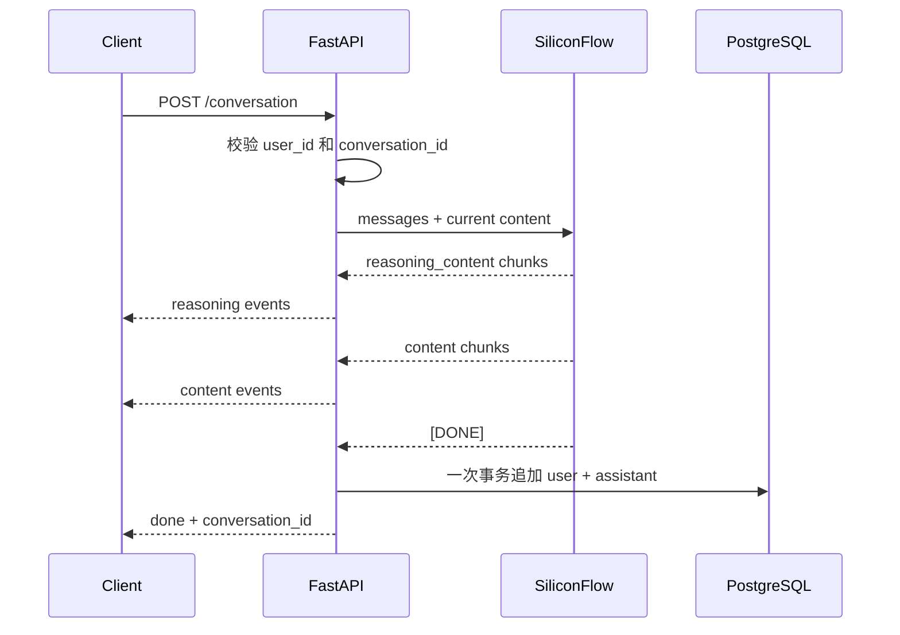

# FastAPI 项目架构

## 结构

```text
src/
├── ai/
│   └── siliconflow.py        # DeepSeek-R1 流式客户端
├── api/v1/
│   ├── conversation.py       # Conversation SSE、查询和删除接口
│   ├── profile.py            # Profile 名称更新接口
│   ├── responses.py          # 通用错误响应声明
│   └── router.py             # v1 路由聚合
├── controllers/
│   ├── conversation.py       # Conversation 查询与完整轮次写入
│   └── profile.py            # Profile 业务操作
├── core/                     # 配置、错误和日志
├── db/
│   ├── models/
│   │   ├── conversation.py   # 内嵌消息数组的 Conversation ORM
│   │   └── profile.py        # 固定用户 Profile ORM
│   └── session.py            # 异步引擎和事务会话
├── schemas/                  # Pydantic 请求和响应模型
├── main.py                   # FastAPI 装配和异常处理
└── middleware.py             # 请求 ID、耗时与访问日志
```

项目不保留独立 Message model、controller、schema 或 route。消息只作为
`conversation.messages` 中的 JSONB 数组元素存在。

## 数据模型

```text
profile
  id
  user_id = "01"
  name

conversation
  id UUID
  user_id = "01"
  title
  messages JSONB
  created_at
```

`messages` 按对话顺序保存：

```json
[
  { "role": "user", "content": "Question" },
  { "role": "assistant", "content": "Answer" }
]
```

每个 `conversation_id` 是一个独立窗口。数据库使用外键关联 profile，并用
check constraint 限制 `user_id = '01'`。

## 流式对话

`POST /api/v1/conversation` 接收客户端提供的历史上下文和本轮问题。历史
`messages` 只用于本次模型输入，不覆盖数据库内容。



只有上游返回 `[DONE]` 且正文非空时才写数据库。流断开或上游报错时返回
`error` 事件，不保存半轮对话。`reasoning_content` 仅用于实时展示，既不持久化，
也不加入下一轮上下文。

流完成后的写入使用生成器内部独立短事务，因为请求级数据库依赖的生命周期
覆盖整个流，不能用于表达“模型完整结束后再提交”的边界。更新已有会话时会锁定
目标行，避免并发追加互相覆盖。

## 接口

- `POST /api/v1/conversation`：流式调用 DeepSeek-R1。
- `GET /api/v1/conversation`：列出 profile `01` 的完整会话。
- `DELETE /api/v1/conversation/{conversation_id}`：删除一个窗口。
- `POST /api/v1/profile`：更新 profile `01` 的名称。

## 配置与迁移

配置通过 `src/core/config.py` 的 `APP_` 前缀读取。AI key 只读取
`APP_SILICONFLOW_API_KEY`，不兼容 `AI_KEY`。密钥必须由本地 `.env` 或部署平台
注入，不应提交到 Git。

Alembic 是生产数据库结构变更的唯一入口：

```bash
uv run alembic upgrade head
```

`20260807_01` 将历史 `message` 行按 ID 顺序聚合到 JSONB，随后删除旧表。应用
启动时不会自动执行迁移。

## 验证

```bash
uv run ruff check .
uv run pytest -q
uv run alembic heads
```
