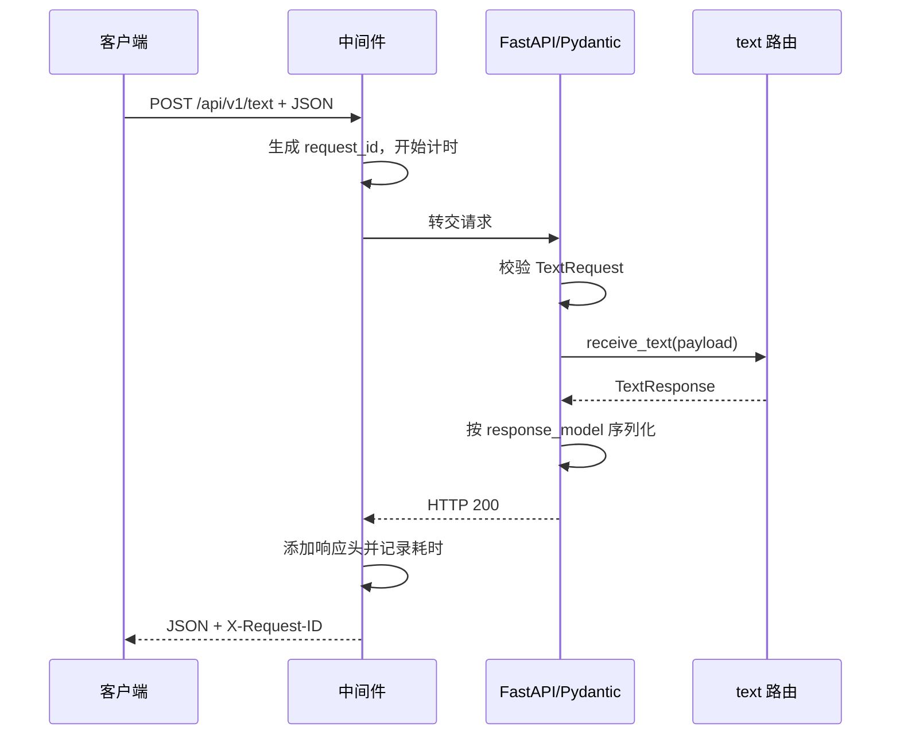

# FastAPI 项目架构说明

## 1. 当前项目结构

```text
fastAPI/
├── .gitignore               # Git 忽略规则，应提交
├── .python-version          # 项目使用的 Python 版本
├── .venv/                   # uv 创建的隔离环境，不提交
├── .pytest_cache/           # pytest 测试框架的运行缓存，不提交
├── .ruff_cache/             # Ruff 代码检查工具的检查缓存，不提交
├── pyproject.toml           # 项目、依赖和工具配置
├── uv.lock                  # 精确锁定依赖版本
├── README.md                # 快速启动说明
├── ARCHITECTURE.md          # 当前架构说明
├── src/
│   ├── __init__.py          # 将 src 标记为 Python 包
│   ├── __pycache__/         # Python 字节码缓存，不提交
│   ├── main.py              # 唯一应用入口和装配中心
│   ├── middleware.py        # 所有 HTTP 请求共用的处理逻辑
│   ├── api/
│   │   └── v1/
│   │       ├── __pycache__/ # Python 执行 API 模块生成的缓存，不提交
│   │       ├── router.py    # 聚合 v1 路由
│   │       └── text.py      # POST /api/v1/text 接口
│   ├── core/
│   │   ├── __pycache__/     # Python 执行 Core 模块生成的缓存，不提交
│   │   ├── config.py        # 配置读取与校验
│   │   ├── errors.py        # 通用业务异常基类
│   │   └── logging.py       # JSON 日志配置
│   └── schemas/
│       ├── __pycache__/     # Python 执行 Schema 模块生成的缓存，不提交
│       ├── common.py        # 通用错误响应结构
│       └── text.py          # 文本接口请求和响应结构
└── tests/
    ├── __pycache__/         # Python 执行测试生成的缓存，不提交
    └── test_api.py          # text 接口行为测试
```

缓存目录属于磁盘上的真实结构，但不属于需要团队维护的源码结构。`__pycache__` 保存 Python 根据源码生成的 `.pyc` 字节码，用于加快导入；删除后会自动重建。

当前没有 `services/`、`repositories/` 或 `dependencies.py` 源码。只有业务复杂到确实需要业务层、数据存储或依赖注入时才新增，不提前创建空层。

## 2. 哪些内容提交 Git

Git 是版本控制工具，用于记录源码历史和团队协作。`.gitignore` 只忽略尚未跟踪的文件，不会删除磁盘文件，也不会自动移除已经提交过的文件。

| 内容                              | 是否提交 | 原因                            |
| --------------------------------- | -------- | ------------------------------- |
| `src/**/*.py`                     | 是       | 项目源码                        |
| `tests/**/*.py`                   | 是       | 测试代码                        |
| `pyproject.toml`                  | 是       | 依赖和工具配置                  |
| `uv.lock`                         | 是       | 锁定精确依赖版本                |
| `.python-version`                 | 是       | 统一 Python 版本                |
| `.gitignore`                      | 是       | 统一忽略规则                    |
| `README.md`、`ARCHITECTURE.md`    | 是       | 项目文档                        |
| `.venv/`                          | 否       | 可由 `uv sync` 重建且与本机相关 |
| `__pycache__/`、`*.pyc`           | 否       | Python 自动生成的字节码缓存     |
| `.pytest_cache/`                  | 否       | pytest 自动生成的测试缓存       |
| `.ruff_cache/`                    | 否       | Ruff 自动生成的检查缓存         |
| `.env`、`.env.*`                  | 否       | 可能包含本地配置或密钥          |
| `build/`、`dist/`、`*.egg-info/`  | 否       | 可重新生成的构建产物            |
| `.DS_Store`、`.idea/`、`.vscode/` | 否       | 系统或个人编辑器配置            |

## 3. 根目录工具和文件

### `uv`

`uv` 是 Python 版本、虚拟环境和依赖管理工具：

- `uv sync` 根据 `pyproject.toml` 和 `uv.lock` 安装依赖。
- `uv run ...` 使用当前项目的 `.venv` 执行命令。
- `.venv/` 是隔离环境，防止不同项目的依赖互相冲突。

### `pyproject.toml`

作用类似 Node.js 的 `package.json`：

- `[project]` 保存项目名、版本、Python 要求和运行依赖。
- `[dependency-groups]` 保存 pytest、Ruff 等开发依赖。
- `[tool.uv] package = false` 表示这是直接运行的应用，不发布成 Python 库。
- `[tool.pytest.ini_options]` 保存测试配置。

### `pytest` 与 Ruff

- **pytest** 是测试框架，负责发现并运行 `tests/` 中的测试。
- **Ruff** 是 Python 代码检查工具，负责发现未使用导入、常见错误和不规范写法。

两者运行后产生的缓存可以删除，不提交 Git。

### `uv.lock`

记录依赖解析后的精确版本。团队执行 `uv sync` 时能安装相同版本，通常应提交且不手工编辑。

## 4. 应用入口与常规基础设施

### `src/main.py`

这是唯一应用入口。启动命令中的 `src.main:app` 表示：

1. 导入 `src/main.py`。
2. 获取其中的 `app` 对象。
3. 由 Uvicorn 运行这个 FastAPI 应用。

文件保留了常规项目需要的内容：

- `lifespan()`：应用启动和关闭生命周期，当前用于初始化日志。
- `create_app()`：创建 FastAPI 并注册中间件、路由和异常处理器。
- `handle_app_error()`：把可预期业务异常转换成统一 JSON。
- `handle_validation_error()`：把请求校验失败转换成统一 422 JSON。
- `app = create_app()`：创建最终运行的应用实例。

错误兜底不是额外业务接口，不会增加 API 路径；它只在请求发生错误时统一响应格式。

### `src/middleware.py`

中间件包裹每次 HTTP 请求，当前负责：

1. 接收或生成 `X-Request-ID`。
2. 计算请求耗时。
3. 把请求 ID 写回响应头。
4. 记录方法、路径、状态码和耗时。

这是适用于所有接口的常规基础设施，不是单独接口。

### `src/core/`

- `config.py`：用 `pydantic-settings` 读取并校验环境配置。
- `errors.py`：定义通用 `AppError`，供将来的业务错误使用。
- `logging.py`：把日志格式化为便于检索的 JSON。

## 5. 当前唯一接口

### 路由注册过程

```text
src/api/v1/text.py
  -> src/api/v1/router.py 聚合
  -> src/main.py 以 /api/v1 前缀注册
  -> POST /api/v1/text
```

`src/api/v1/text.py` 使用 FastAPI 装饰器声明接口：

```python
@router.post("", response_model=TextResponse)
def receive_text(payload: TextRequest) -> TextResponse:
    return TextResponse(text=payload.text)
```

请求 JSON：

```json
{
  "text": "Hello FastAPI"
}
```

响应 JSON：

```json
{
  "text": "Hello FastAPI"
}
```

`src/schemas/text.py` 中的 Pydantic 模型负责校验请求并约束响应。接口只接收 JSON；form-data 会得到 422 校验错误。

### 为什么保留 `api/v1`

`v1` 表示第一个公开 API 版本。以后出现不兼容修改时，可以增加 `v2`，让旧客户端有迁移时间。

保留版本号的好处：

1. 新旧契约可以暂时并存。
2. 不强迫所有客户端同时升级。
3. 从 URL 能看出使用的契约版本。

代价是增加目录层级。当前项目虽然只有一个接口，但用户已经询问过版本设计，因此保留 `v1`；它不会额外创建接口。

## 6. 一次请求如何流动



校验发生在路由函数执行之前。JSON 不合法时，路由不会执行，而是由统一校验错误处理器返回 422。

## 7. FastAPI 核心概念

- **`APIRouter`**：拆分和聚合路由。
- **`response_model`**：约束响应结构，并用于生成 OpenAPI 文档。
- **Pydantic**：根据 Python 类型注解校验请求和序列化响应。
- **OpenAPI**：描述 API 路径、参数和响应的标准格式。
- **Swagger UI**：根据 OpenAPI 生成的可交互接口页面。
- **ASGI**：Python Web 服务器调用异步 Web 应用的标准接口。
- **Uvicorn**：监听端口并通过 ASGI 调用 FastAPI 的 Web 服务器。

## 8. 进程、线程与 Uvicorn

### 通俗理解

- **进程**像一间独立办公室，有自己的内存和资源。
- **线程**像同一办公室里的员工，共享办公室里的内存和资源。

不同进程默认不共享内存；同一进程的线程共享内存，所以线程同时修改数据时需要小心。

### 专业总结

进程是操作系统进行资源分配和隔离的基本单位；线程是进程内部执行任务的基本单位。Python 的 `async def` 主要通过事件循环在等待 I/O 时切换任务，不等同于自动创建线程，也不等同于 CPU 并行计算。

### `--reload` 如何工作

```bash
uv run uvicorn src.main:app --reload
```

执行这一条命令后，Uvicorn 自动创建：

1. 监控父进程：观察 Python 文件是否变化。
2. 服务子进程：加载 FastAPI 并处理请求。

保存源码后，父进程停止旧子进程并创建新子进程，新代码因此生效。正常停止时在启动终端按 `Ctrl+C`，让父子进程一起退出。

不需要热重载时：

```bash
uv run uvicorn src.main:app
```

生产环境需要多个独立 worker 时可以明确指定：

```bash
uv run uvicorn src.main:app --workers 4
```

`--reload` 用于开发，`--workers` 用于多进程运行，不同时使用。每个 worker 都有自己的内存和全局变量。

## 9. 扩展原则

现在接口只是 JSON 回显，不需要 Service、Repository 或数据库。只有出现真实需求时才增加对应层：

- 路由开始包含复杂业务规则时，增加 Service。
- 需要数据库或其他持久化时，增加 Repository。
- 多处需要创建和复用对象时，增加依赖注入模块。
- 不为了看起来“企业级”而提前创建空模块或示例接口。

## 10. 常用命令

```bash
# 安装或同步依赖
uv sync

# 启动开发服务
uv run uvicorn src.main:app --reload

# 运行测试
uv run pytest

# 检查代码
uv run ruff check src tests
```

启动后可访问：

- Swagger UI：<http://127.0.0.1:8000/docs>
- OpenAPI JSON：<http://127.0.0.1:8000/openapi.json>
